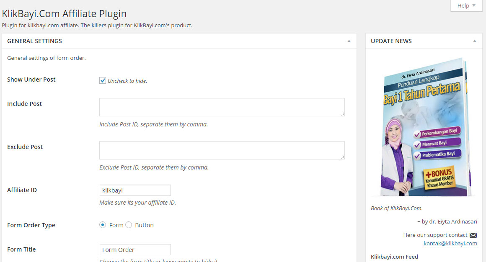
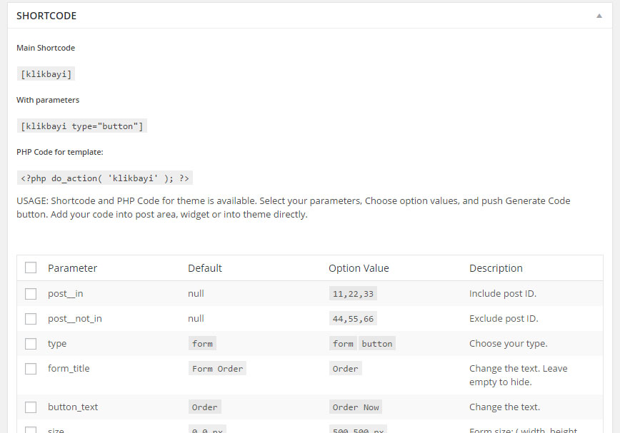

Description
===========
Klik Bayi plugin is created to support http://klikbayi.com/ affiliaters to selling klikbayi.com's product with embeded form or button order into Wordpress site. Widget, Shortcode, and PHP Code for theme is available.

Installation
============
1. Upload plugin zip contents to wp-contents/plugin directory and activate the plugin.
2. Go to Klik Bayi > Settings, settup your affiliate ID, make some configuration if you need, and save your work.
3. You can insert shortcodes and php code into administration posts area, widget or direct into your theme.

Frequently Asked Questions
==========================
= How do I setup my WordPress theme to work with Klik Bayi plugin =

You can use php code ```<?php do_action('klikbayi'); ?>``` and add this single line code after the_content code. Single or sitewide pages is welcome. More advance code is available.

Screenshots
===========
1. Part of setting screenshot-1.jpg.


2. Part of shortcode generator screenshot-2.jpg.


Changelog
=========
* 1.0 = October 13, 2015
  * First official release!
